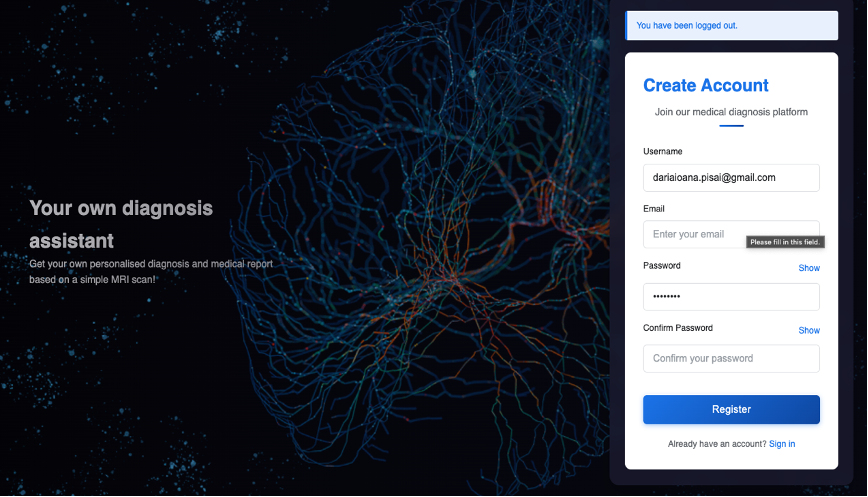
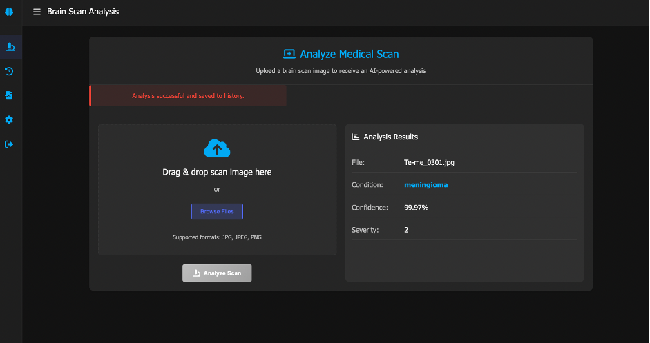
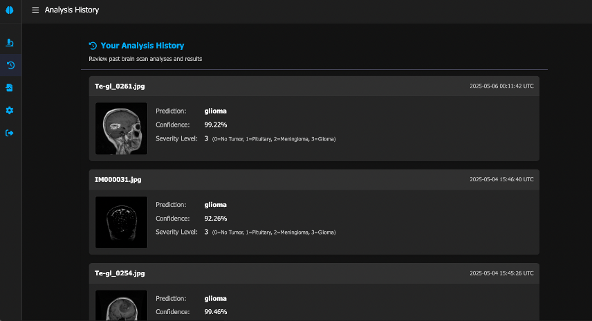
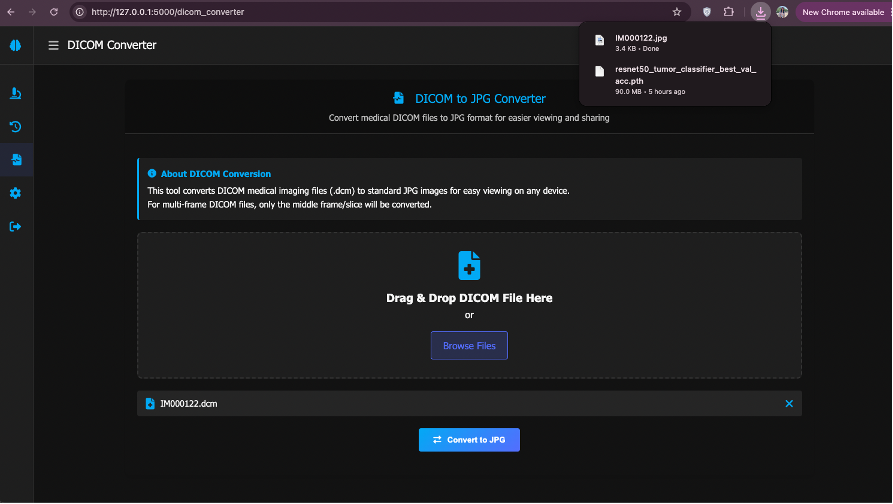

# Brain Tumor Identification App from MRI Scans 

**Author:** Daria Pisai
**Project Link:** [https://github.com/dariaPisai/medical_scan_app](https://github.com/dariaPisai/medical_scan_app)

## Description

This application is designed to assist in the identification of brain tumors from Magnetic Resonance Imaging (MRI) scans. The primary goal is to simplify the interpretation process of MRI images for patients and potentially reduce the waiting time between medical analysis and consultation. The application can classify brain scans into four categories: meningioma, glioma, pituitary tumor, or no tumor.

It utilizes a **ResNet50 (Residual Neural Network with 50 layers)** architecture for image classification and includes a utility to convert DICOM (.dcm) files to JPEG (.jpg) format, making medical images more accessible.

## Features

* **User Authentication:** Secure registration and login system for users.
* **MRI Scan Analysis:**
    * Upload MRI images (JPEG format) for analysis.
    * Classification of brain tumors into:
        * No Tumor
        * Pituitary Tumor
        * Meningioma
        * Glioma
    * Displays analysis results including predicted tumor type, confidence score, and a simplified severity level.
* **Image Preprocessing:** Includes steps like grayscale conversion, Gaussian blur, binary thresholding, morphological operations, and contour detection to prepare images for the model.
* **Analysis History:** Users can view a history of their uploaded scans and the corresponding analysis reports.
* **DICOM to JPG Converter:** An integrated tool to convert medical images from DICOM format to the more common JPG format. For multi-frame DICOM files, the middle frame is converted.
* **ResNet50 Model:** Leverages the ResNet50 deep learning model, trained for classifying the specified brain tumor types. The project explored both training from scratch and using a pre-trained model (on ImageNet) with fine-tuning.

## Technologies Used

* **Backend Framework:**
    * **Flask:** A micro web framework for Python.
* **Machine Learning Framework:**
    * **PyTorch (Torch):** Used for building and training the ResNet50 model.
* **Web Development Libraries & Tools (Flask Extensions & Others):**
    * `flask_sqlalchemy`: For database interaction using SQLAlchemy.
    * `flask_login`: For handling user sessions and authentication.
    * `flask_migrate`: For database schema migrations (using Alembic).
    * `flask_wtf`: For working with WTForms (form creation, validation, CSRF protection).
    * `Werkzeug`: WSGI utility library for Flask.
    * `Jinja2`: Templating engine for rendering HTML pages.
* **Machine Learning & Image Processing Libraries:**
    * `torchvision`: Provides access to pre-trained models (like ResNet50), image datasets, and image transformation functions.
    * `OpenCV (cv2)`: Used for various image processing tasks (reading images, color space conversions, filtering, thresholding, morphological operations, contour detection).
    * `Pillow (PIL)`: For basic image manipulation operations (opening, saving, conversions).
    * `Numpy`: For numerical operations, especially handling image data as arrays.
    * `Pydicom`: For reading, modifying, and writing DICOM files.
* **Model Evaluation & Data Visualization:**
    * `Scikit-learn`: Used for calculating performance metrics like confusion matrix, F1-score, precision, recall, and accuracy.
    * `Matplotlib`: For creating static, animated, and interactive visualizations (e.g., plotting training progress).
* **Standard Python Libraries:**
    * `os`: For interacting with the operating system (file/directory manipulation).
    * `io`: For handling I/O operations (e.g., byte streams).
    * `uuid`: For generating unique identifiers.
    * `datetime`: For working with dates and times.
* **Database:** (Implicitly, via Flask-SQLAlchemy, likely SQLite for development or PostgreSQL/MySQL for production - *specify if known*)

## Usage

1.  **Register & Login:**
    * Navigate to the application in your web browser.
    * Create a new account using the registration form.
    * Log in with your credentials.

2.  **Analyze an MRI Scan (JPEG):**
    * Go to the main analysis page ("Brain Scan Analysis").
    * Click the "Browse" button or drag and drop a JPEG MRI scan image.
    * Once the image is uploaded, click the "Analyze Scan" button.
    * The results (predicted tumor type, confidence, severity) will be displayed.

3.  **View Analysis History:**
    * Access the "Analysis History" page from the navigation menu (typically on the left sidebar).
    * Review past uploaded scans and their corresponding analysis reports.

4.  **Convert DICOM to JPG:**
    * Navigate to the "DICOM Converter" tool (typically on the left sidebar).
    * Upload a DICOM file (`.dcm`).
    * Click the "Convert to JPG" button.
    * The converted JPEG image will be automatically downloaded to your computer.

## Screenshots

* 
* 
* 
* 

## Model Performance

The ResNet50 model was trained and evaluated on a dataset of brain MRI images (sourced from Kaggle: "Brain Tumor MRI Dataset"). The classification task involves identifying 'no tumor', 'pituitary tumor', 'meningioma', and 'glioma'.

Performance metrics such as accuracy, precision, recall, and F1-score were used for evaluation. The project also compared:
1.  A ResNet50 model trained from scratch.
2.  A ResNet50 model pre-trained on ImageNet and then fine-tuned on the brain tumor dataset.

**Key Findings from the PDF (Table 1):**
* **ResNet50 (Trained from scratch):**
    * Final Training Accuracy: ~97.17%
    * Final Validation Accuracy: ~96.78%
* **ResNet50 (Pre-trained on ImageNet & Fine-tuned):**
    * Final Training Accuracy: ~89.29%
    * Final Validation Accuracy: ~90.11%

The model trained from scratch showed superior final accuracy on this specific dataset, though the pre-trained model had better initial performance.

